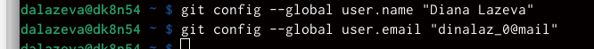
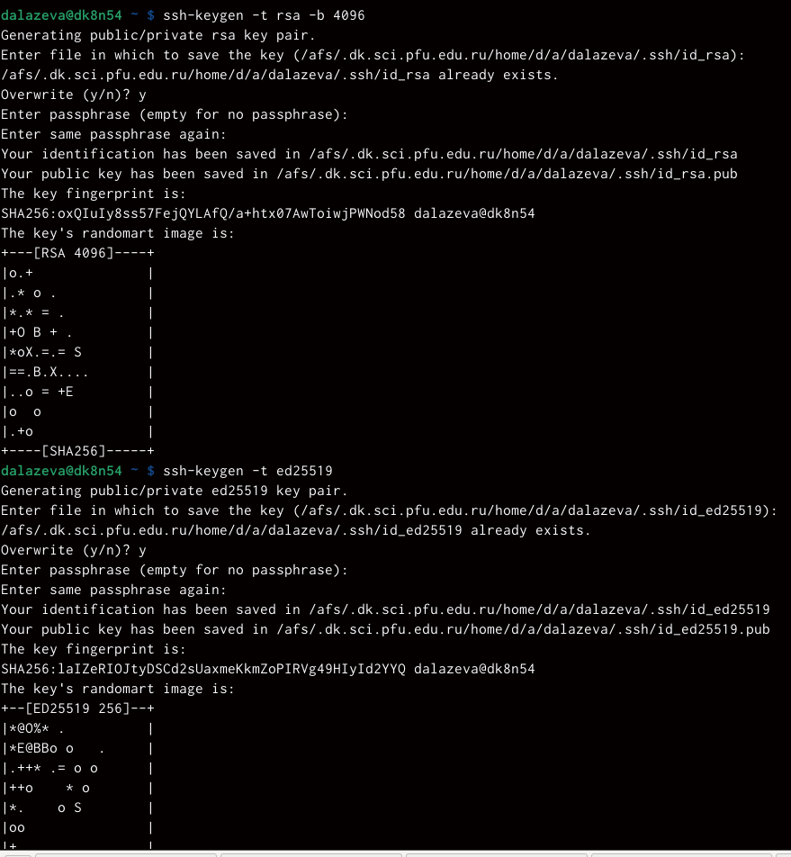
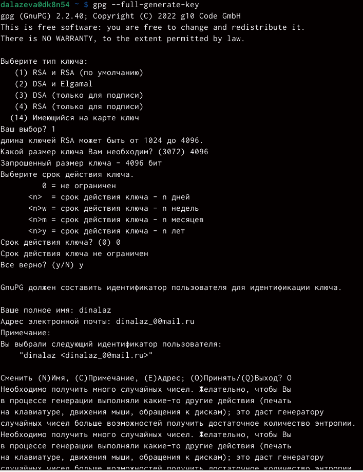
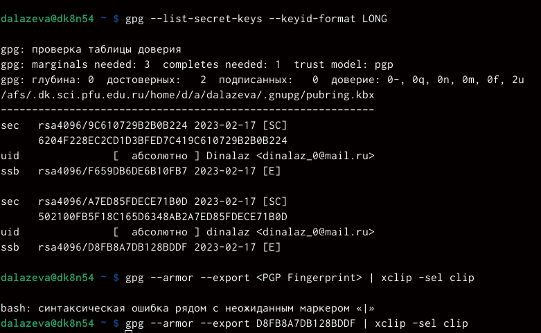
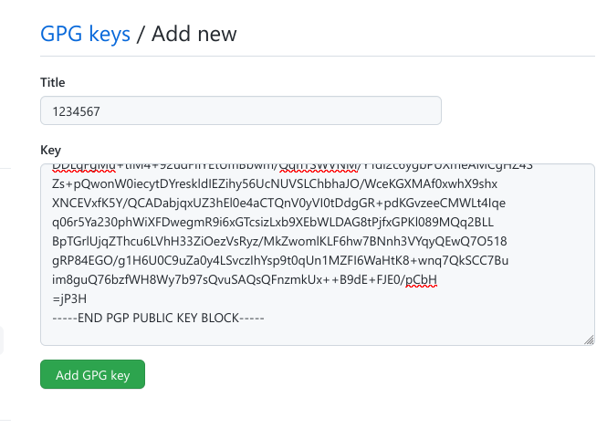
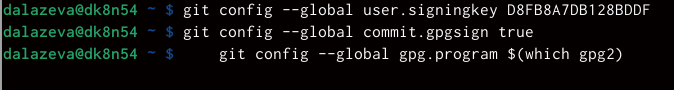
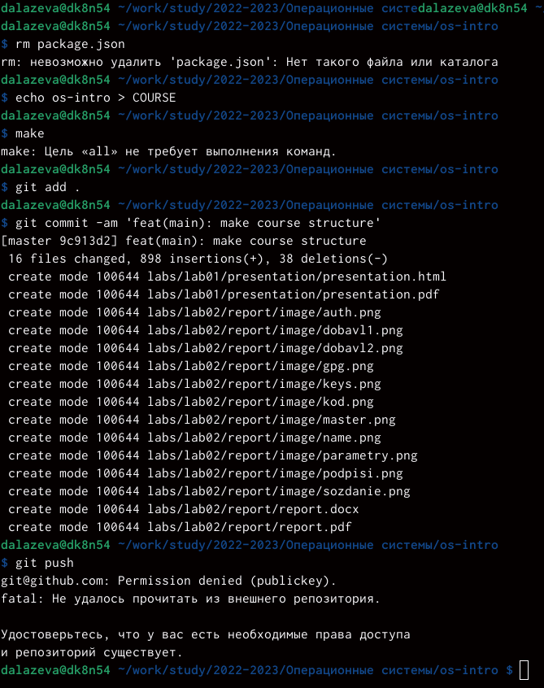

---
## Front matter
lang: ru-RU
title: лабораторная работа №2
subtitle: операционные системы
author:
  - Лазева Д.А.
institute:
  - Российский университет дружбы народов, Москва, Россия
  - ФФМиЕН НБИбд-04-22
date: 17.02.2023

## i18n babel
babel-lang: russian
babel-otherlangs: english

## Formatting pdf
toc: false
toc-title: Содержание
slide_level: 2
aspectratio: 169
section-titles: true
theme: metropolis
header-includes:
 - \metroset{progressbar=frametitle,sectionpage=progressbar,numbering=fraction}
 - '\makeatletter'
 - '\beamer@ignorenonframefalse'
 - '\makeatother'
---

# Информация

## Докладчик

:::::::::::::: {.columns align=center}
::: {.column width="70%"}

  * Лазева Диана Анатольевна
  * студентка нбибд-04-22
  * Российский Университет Дружбы Народов


:::
::::::::::::::

# Вводная часть

## Актуальность

Лабораторная работа актуальна для тех, кто желаем освоить GitHub.

## Объект и предмет исследования

- Презентация как текст
- Программное обеспечение для создания презентаций
- Входные и выходные форматы презентаций

## Цели и задачи


- Изучить идеологию и применение средств контроля версий.
- Освоить умения по работе с git.

## Материалы и методы

- Процессор `pandoc` для входного формата Markdown
- Результирующие форматы
	- `pdf`
	- `html`
- Автоматизация процесса создания: `Makefile`

# Создание презентации

## Процессор `pandoc`

- Pandoc: преобразователь текстовых файлов
- Сайт: <https://pandoc.org/>
- Репозиторий: <https://github.com/jgm/pandoc>

## Формат `pdf`

- Использование LaTeX
- Пакет для презентации: [beamer](https://ctan.org/pkg/beamer)
- Тема оформления: `metropolis`

## Код для формата `pdf`

```yaml
slide_level: 2
aspectratio: 169
section-titles: true
theme: metropolis
```

## Формат `html`

- Используется фреймворк [reveal.js](https://revealjs.com/)
- Используется [тема](https://revealjs.com/themes/) `beige`

## Код для формата `html`

- Тема задаётся в файле `Makefile`

```make
REVEALJS_THEME = beige 
```
# Результаты

## Получающиеся форматы

- Полученный `pdf`-файл можно демонстрировать в любой программе просмотра `pdf`
- Полученный `html`-файл содержит в себе все ресурсы: изображения, css, скрипты

# 

## Содержание исследования
1. Базовая настройка git (рис.[-@fig:001])
{#fig:001 width=90%} 

## 
2. (рис. [-@fig:002])
{#fig:002 width=90%} 


## 
3. (рис. [-@fig:003])

{#fig:003 width=90%} 


## 
4. (рис. [-@fig:004])

{#fig:004 width=90%}

## 

5. Создаем ключи ssh (рис. [-@fig:005])

{#fig:005 width=90%}


##
6. Создаем ключи pgp (рис. [-@fig:006])

{#fig:006 width=90%}


## 
7. Добавление PGP ключа в GitHub(рис. [-@fig:007])

 {#fig:007 width=90%}


8. вставляем ключ (рис. [-@fig:008])
{#fig:008 width=90%} 

## 
9. 
Настройка автоматических подписей коммитов git (рис. [-@fig:009])

{#fig:009 width=90%}

 

## 

10. Настройка gh (рис.[-@fig:010])

{#fig:010 width=90%}


##
11. Создание репозитория курса на основе шаблона (рис.[-@fig:011])

{#fig:011 width=90%}


##
12. Настройка каталога курса рис.[-@fig:012]

{#fig:012 width=90%}

## результаты

- Настроили GitHub 
- Создали ключи

## итоговый слайд

- В ходе выполнения лабораторной работы, мы изучили идеологию и применение средств контроля версий и освоили умения работать с git.

