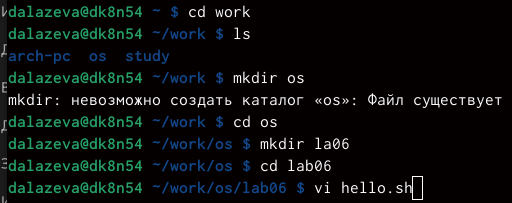
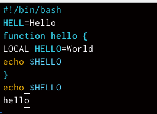
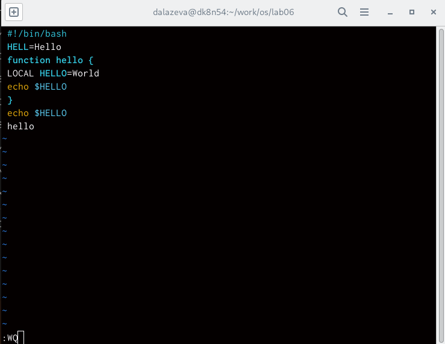
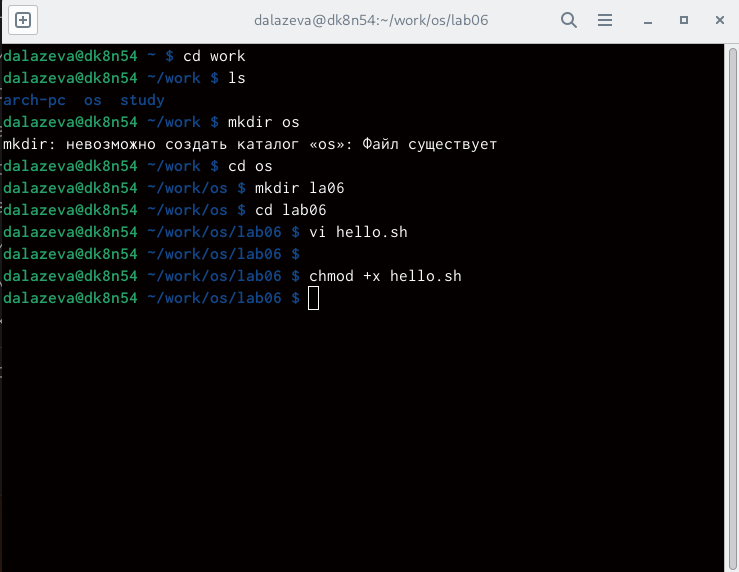
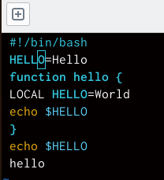
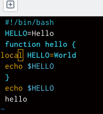
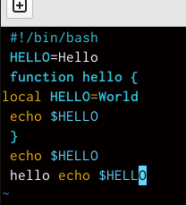
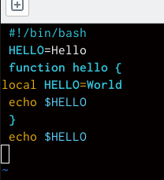
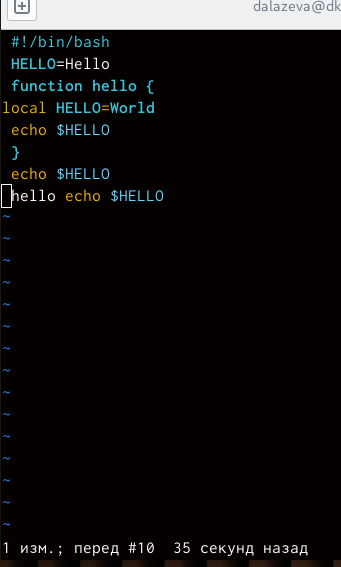
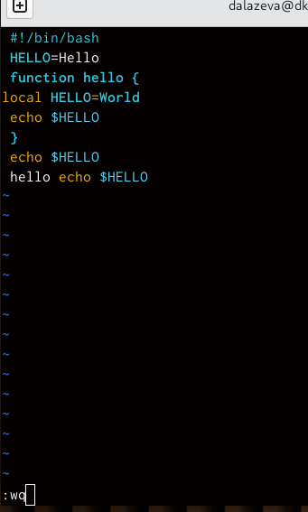

---
## Front matter
lang: ru-RU
title: презентация по лабортаторной работе
subtitle: лабораторная работа 8
author:
  - Лазева Д. А.
institute:
  - Российский университет дружбы народов, Москва, Россия
 
date: 29 марта 2023

## i18n babel
babel-lang: russian
babel-otherlangs: english

## Formatting pdf
toc: false
toc-title: Содержание
slide_level: 2
aspectratio: 169
section-titles: true
theme: metropolis
header-includes:
 - \metroset{progressbar=frametitle,sectionpage=progressbar,numbering=fraction}
 - '\makeatletter'
 - '\beamer@ignorenonframefalse'
 - '\makeatother'
---

# Информация

## Докладчик

:::::::::::::: {.columns align=center}
::: {.column width="70%"}

  * Лазева Диана Анатольевна
  * студентка
  * студентка кафедры информационных технологий
  * Российский университет дружбы народов
  

:::
::: {.column width="30%"}

:::
::::::::::::::

# Вводная часть

## Актуальность

- Важно донести результаты своих исследований до окружающих
- Научная презентация --- рабочий инструмент исследователя
- Необходимо создавать презентацию быстро
- Желательна минимизация усилий для создания презентации

## Объект и предмет исследования

- линукс
- vi
- Входные и выходные форматы презентаций

## Цели и задачи

- Познакомиться с операционной системой Linux. Получить практические навыки рабо-
ты с редактором vi, установленным по умолчанию практически во всех дистрибутивах

## Материалы и методы

- дистрибутивы линукс

# ход работы

##  создаю новый каталог и вызываю ви и создаю новывй файл

##  ввожу следующий текст

##  перехожу в командный режим, в режим последней строки, сохраняю файл и завершаю работу

## делаю файл исполняемым

## вызываю ви на редактирование файла

.png)

## заменяю хелл на хелло и возвращаюсь в команджный режим

## заменяю ЛОКАЛ на локал и возвращаюсь в командный режим

## вставляю после последней строки echo $HELLO и перехожу в командный режим

## удаляю последнюю строку 

##отменяю последнюю команду

## записываю произведенные изменения и выхожу из ви

## вывод

  - я познакомилась с операционной системой линукс. получила практические навыки работы с редактором ви

#спасибо за внимание

