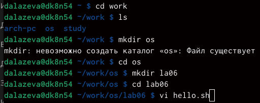
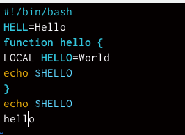
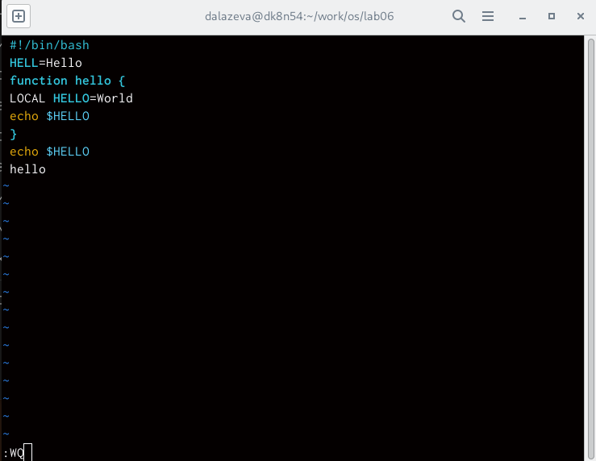
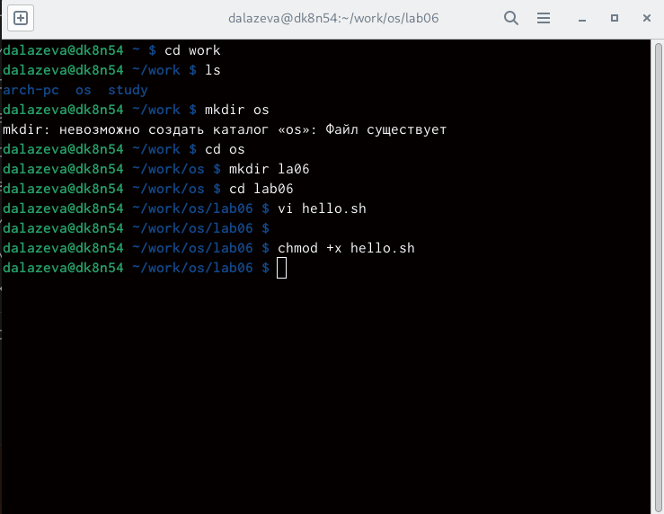
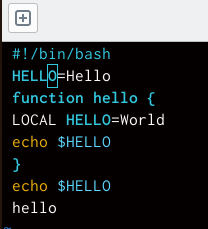
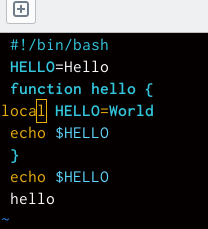
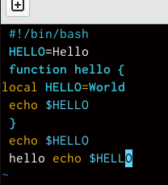
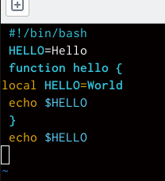
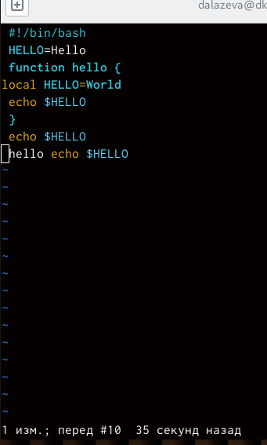
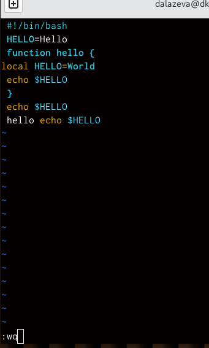

---
## Front matter
title: "отчет по лабораторной работе"
subtitle: "лабораторная работа 8"
author: "Лазева Диана Анатольевна"

## Generic otions
lang: ru-RU
toc-title: "Содержание"

## Bibliography
bibliography: bib/cite.bib
csl: pandoc/csl/gost-r-7-0-5-2008-numeric.csl

## Pdf output format
toc: true # Table of contents
toc-depth: 2
lof: true # List of figures
lot: true # List of tables
fontsize: 12pt
linestretch: 1.5
papersize: a4
documentclass: scrreprt
## I18n polyglossia
polyglossia-lang:
  name: russian
  options:
	- spelling=modern
	- babelshorthands=true
polyglossia-otherlangs:
  name: english
## I18n babel
babel-lang: russian
babel-otherlangs: english
## Fonts
mainfont: PT Serif
romanfont: PT Serif
sansfont: PT Sans
monofont: PT Mono
mainfontoptions: Ligatures=TeX
romanfontoptions: Ligatures=TeX
sansfontoptions: Ligatures=TeX,Scale=MatchLowercase
monofontoptions: Scale=MatchLowercase,Scale=0.9
## Biblatex
biblatex: true
biblio-style: "gost-numeric"
biblatexoptions:
  - parentracker=true
  - backend=biber
  - hyperref=auto
  - language=auto
  - autolang=other*
  - citestyle=gost-numeric
## Pandoc-crossref LaTeX customization
figureTitle: "Рис."
tableTitle: "Таблица"
listingTitle: "Листинг"
lofTitle: "Список иллюстраций"
lotTitle: "Список таблиц"
lolTitle: "Листинги"
## Misc options
indent: true
header-includes:
  - \usepackage{indentfirst}
  - \usepackage{float} # keep figures where there are in the text
  - \floatplacement{figure}{H} # keep figures where there are in the text
---

# Цель работы

Познакомиться с операционной системой Linux. Получить практические навыки работы с редактором vi, установленным по умолчанию практически во всех дистрибутивах.

# Задание

Познакомиться с операционной системой Linux. Получить практические навыки рабо-
ты с редактором vi, установленным по умолчанию практически во всех дистрибутивах.

# Теоретическое введение

70
Лабораторная работа No 8. Текстовой редактор vi
8.1. Цель работы
Познакомиться с операционной системой Linux. Получить практические навыки рабо-
ты с редактором vi, установленным по умолчанию практически во всех дистрибутивах.
8.2. Указания к работе
В большинстве дистрибутивов Linux в качестве текстового редактора по умолчанию
устанавливается интерактивный экранный редактор vi (Visual display editor).
Редактор vi имеет три режима работы:
– командный режим — предназначен для ввода команд редактирования и навигации по
редактируемому файлу;
– режим вставки — предназначен для ввода содержания редактируемого файла;
– режим последней (или командной) строки — используется для записи изменений в файл
и выхода из редактора.
Для вызова редактора vi необходимо указать команду vi и имя редактируемого файла:
vi <имя_файла>
При этом в случае отсутствия файла с указанным именем будет создан такой файл.
Переход в командный режим осуществляется нажатием клавиши Esc . Для выхода из
редактора vi необходимо перейти в режим последней строки: находясь в командном
режиме, нажать Shift-; (по сути символ : — двоеточие), затем:
– набрать символы wq, если перед выходом из редактора требуется записать изменения
в файл;
– набрать символ q (или q!), если требуется выйти из редактора без сохранения.
Замечание. Следует помнить, что vi различает прописные и строчные буквы при наборе
(восприятии) команд.

# Выполнение лабораторной работы

1. создаю новый каталог и вызываю ви и создаю новывй файл (рис. [-@fig:001])

{#fig:001 width=70%}

2. ввожу следующий текст (рис. [-@fig:002])

{#fig:002 width=70%}

3. перехожу в командный режим, в режим последней строки, сохраняю файл и завершаю работу (рис. [-@fig:003])

{#fig:003 width=70%}

4. делаю файл исполняемым (рис. [-@fig:004])
{#fig:004 width=70%}

5. вызываю ви на редактирование файла (рис. [-@fig:005])
.png){#fig:005 width=70%}

6. заменяю хелл на хелло и возвращаюсь в команджный режим (рис. [-@fig:006])
{#fig:006 width=70%}

7. заменяю ЛОКАЛ на локал и возвращаюсь в командный режим (рис. [-@fig:007])
{#fig:007 width=70%}

8. вставляю после последней строки echo $HELLO и перехожу в командный режим (рис. [-@fig:008])
{#fig:008 width=70%}

9. удаляю последнюю строку (рис. [-@fig:009])
{#fig:009 width=70%} 

10. отменяю последнюю команду (рис. [-@fig:010])
{#fig:010 width=70%} 

11. записываю произведенные изменения и выхожу из ви (рис. [-@fig:011])
{#fig:011 width=70%} 

# Выводы

я познакомилась с операционной системой линукс. получила практические навыки работы с редактором ви

# Список литературы{.unnumbered}

::: {#refs}
:::
